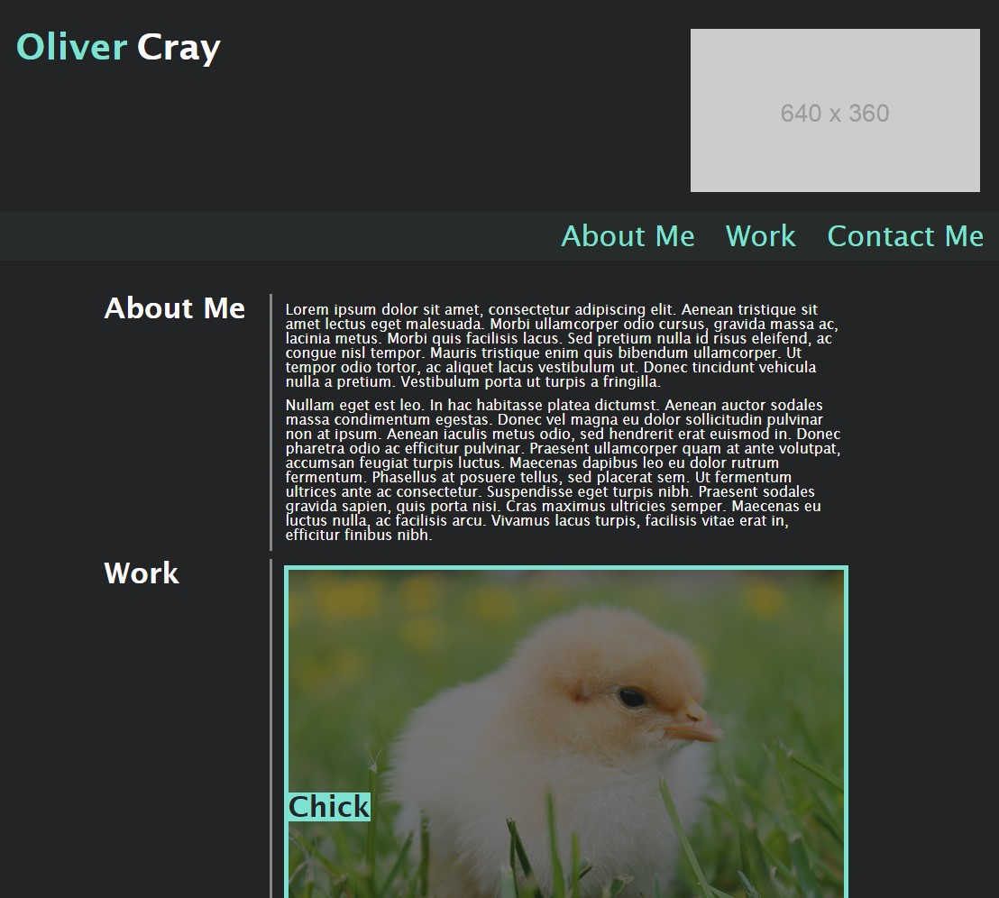

# oliver-cray-portfolio

## Purpose of task

Creation of a portfolio page that I can use to showcase my future deployed projects over the course of the bootcamp. Makes use of semantic HTML, flexbox, media queries for responsive design and other CSS learnt so far such as variables, pseudo elements and pseudo classes.

## User Story

```
AS AN employer
I WANT to view a potential employee's deployed portfolio of work samples
SO THAT I can review samples of their work and assess whether they're a good candidate for an open position
```


## Acceptance Criteria

Here are the critical requirements necessary to develop a portfolio that satisfies a typical hiring manager’s needs:

```
GIVEN I need to sample a potential employee's previous work
WHEN I load their portfolio
THEN I am presented with the developer's name, a recent photo or avatar, and links to sections about them, their work, and how to contact them
WHEN I click one of the links in the navigation
THEN the UI scrolls to the corresponding section
WHEN I click on the link to the section about their work
THEN the UI scrolls to a section with titled images of the developer's applications
WHEN I am presented with the developer's first application
THEN that application's image should be larger in size than the others
WHEN I click on the images of the applications
THEN I am taken to that deployed application
WHEN I resize the page or view the site on various screens and devices
THEN I am presented with a responsive layout that adapts to my viewport
```

## Problems Solved

- Name appears at the top with a placeholder image, below is a nav link containing links to "About Me", "Work" and "Contact Me" sections
- Clicking a link in the navbar will scroll to the appropriate section without obscuring the section itself, the navbar sticks to the top of the page to allow for easy access to other sections
- All images are titled with placeholder links that currently point to my GitHub, these will be updated as I have projects to add, and the main image is larger than the others
- The page makes use of media queries to allow the site's layout to adapt to changes in the size of the viewport


## Screenshot

 

## Deployed Webpage

The published page is available here: https://olivercray.github.io/oliver-cray-portfolio/